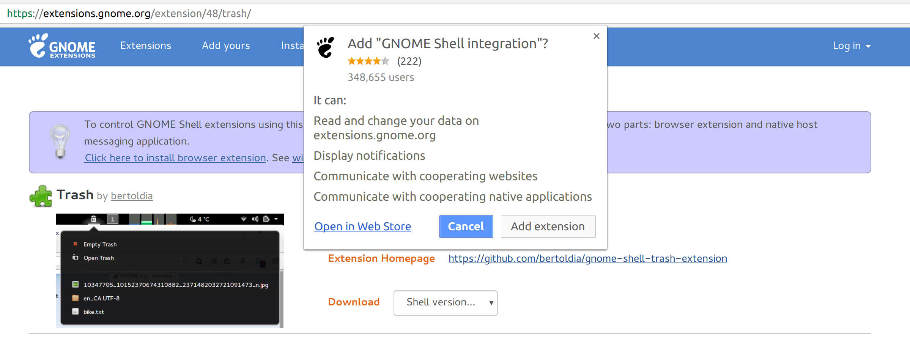
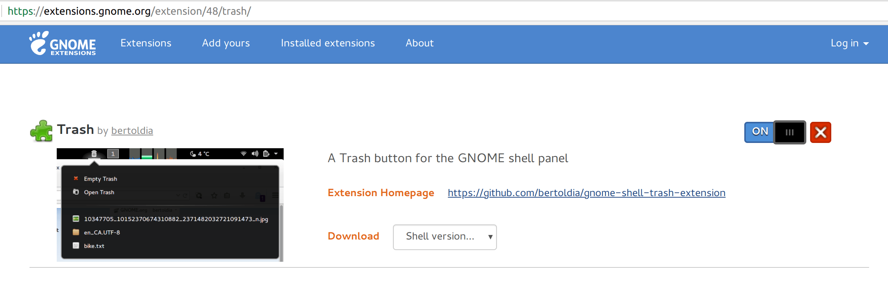
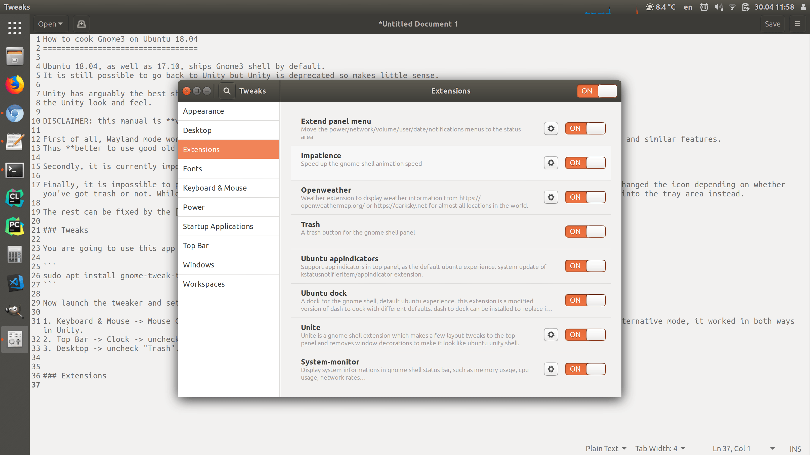
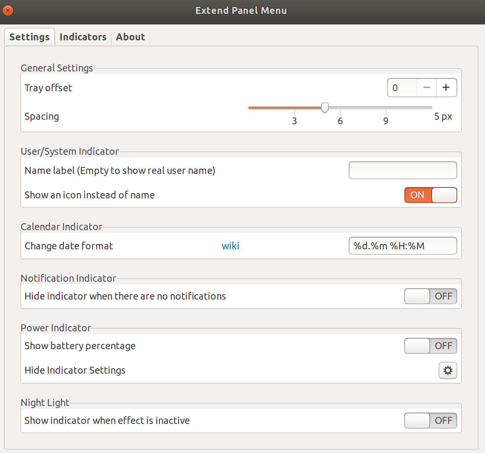

How to cook Gnome3 on Ubuntu 18.04
==================================

Ubuntu 18.04, as well as 17.10, ships Gnome3 shell by default.
It is still possible to go back to Unity but Unity is deprecated so makes little sense.

Unity has arguably the best shell UX and this guide explains how to polish Gnome3 to give it
the Unity look and feel.

DISCLAIMER: this manual is **very** opinionated.

First of all, Wayland mode works pretty bad with Gnome3: slow as hell, mouse lags, no support for TeamViewer/Skype screen share and similar features.
Thus **better to use good old XOrg session**.

Secondly, it is currently impossible to return the global menu back, one of the best things which were ever copied from macOS.

Finally, it is impossible to place the trash can to the right panel as it was in Unity. It was cool because it saved time and changed the icon depending on whether you've got trash or not. While there is a way to place the trash can shortcut, it is no longer dynamic, so I suggest to put it into the tray area instead.

The rest can be fixed by the [Gnome extensions](https://extensions.gnome.org/).

### Meltdown and Spectre

[Meltdown and Spectre](https://meltdownattack.com/) are low-level CPU architecture attacks. They cannot be efficiently fixed so the patches introduce 5-30% slowdown. At the same time, those vulnerabilities are not easy to use or widespread. In order to disable the kernel patches, edit `/etc/default/grub`, insert `pti=off spectre_v2=off` into `GRUB_CMDLINE_LINUX`:

```
GRUB_CMDLINE_LINUX="pti=off spectre_v2=off"
```

And then regenerate the boot config:

```
sudo update-grub
```

### Close, maximize and minimize buttons on the left

```
gsettings set org.gnome.desktop.wm.preferences button-layout 'close,maximize,minimize:'
```

### "Nine dots" on the top

```
gsettings set org.gnome.shell.extensions.dash-to-dock show-apps-at-top true
```

### Tweaks

You are going to use this app a lot:

```
sudo apt install gnome-tweak-tool
```

Now launch the tweaker and setup the following swagger:

1. Keyboard & Mouse -> Mouse Click Emulation -> Area - this enables the right click on the touchpad. No idea why there is an alternative mode, it worked in both ways in Unity.
2. Top Bar -> Clock -> uncheck "Seconds". This is simply annoying - your screen constanly changes and it draws your attention.
3. Desktop -> uncheck "Trash". We will do it better with an extension.

### Autologin

I hate entering any passwords at startup, also I don't care about security and privacy, so I edited
`/etc/gdm3/custom.conf`:

```ini
[daemon]
# Uncoment the line below to force the login screen to use Xorg
#WaylandEnable=false

# Enabling automatic login
AutomaticLoginEnable = true
AutomaticLogin = vadim
```

### Extensions

In order to install extensions painlessly from a web browser, run:

```
sudo apt install chrome-gnome-shell
```

Despite of it's name, it enables the support in Firefox as well. Now go to [extensions](https://extensions.gnome.org/extension/48/trash/) and install the browser extension which is suggested.



After reloading, you will have the button in the top right area:



The extensions are configurable in the tweaker app:



### Impatience

[Impatience](https://extensions.gnome.org/extension/277/impatience/) increases the animation speed. Much recommended.

### Openweather

[Openweather](https://extensions.gnome.org/extension/750/openweather/) shows the weather in the tray.
I don't like the text after the weather glyph so I edited
`~/.local/share/gnome-shell/extensions/openweather-extension@jenslody.de/openweathermap_org.js`,
line 366:

```javascript
this._weatherInfo.text = /*weatherInfoC +*/ ((weatherInfoC && weatherInfoT) ? _(" ") : "") + weatherInfoT;
```

Log out and then in to refresh.

### Unite

[Unite](https://extensions.gnome.org/extension/1287/unite/) fixes Gnome3 in many places to save the precious space and behave more like Unity. Must have.

### Tray editor

[Extend Panel Menu](https://extensions.gnome.org/extension/1201/extend-panel-menu/) allows to edit the system tray items. When I installed it, it glitched,
but log out/in cured everything.
It allows to setup the date and time format:



### System load indicator

This guy is tricky to setup but works.

Install the deps first:

```
sudo apt install gir1.2-gtop-2.0 gir1.2-networkmanager-1.0  gir1.2-clutter-1.0
```

Then the extension: [link](https://extensions.gnome.org/extension/120/system-monitor/).

It will **not** work. Change `./local/share/gnome-shell/extensions/system-monitor@paradoxxx.zero.gmail.com/extension.js` on line 2372,
before:
```javascript
let _gsmApp = _appSys.lookup_app('gnome-system-monitor.desktop');
```
to:
```javascript
let _gsmApp = _appSys.lookup_app('gnome-system-monitor_gnome-system-monitor.desktop');
```
Now disable the extension, log out/in and then enable it.

By default it is ugly. Here is what I changed:

1. Unchecked "Show Text" everywhere
2. Unchecked "Display Icon"
3. Set the fully transparent background color
4. Left only CPU and disk - removed memory and network. Memory is useless to monitor, network is always empty
